# Diagrams

## Component Layout

```mermaid
graph TB
    subgraph MainWindow
        direction TB
        HM[Hamburger Menu]
        SB[Status Bar: file info | SSH profile combo | progress bar | info]

        subgraph MainSplitter[Main Splitter - Horizontal]
            direction LR
            FB[FileBrowser]

            subgraph RightSplitter[Right Splitter - Vertical]
                direction TB
                subgraph TabWidget[Top Tab Widget]
                    T0[AI-terminal Tab]
                    T1[Editor Tab 1]
                    T2[Editor Tab N]
                end

                subgraph BottomTabWidget[Bottom Tab Widget]
                    PT[Prompt Tab: PromptEdit + Send/Commit/Save]
                    BT[Terminal Tab]
                end
            end
        end
    end
```

## Class Hierarchy

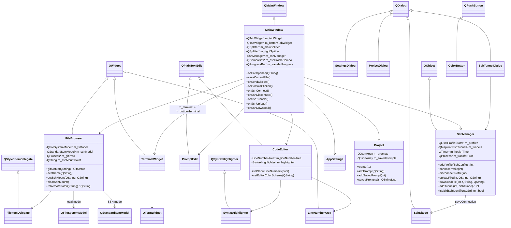

## Signal Flow — Prompt Send

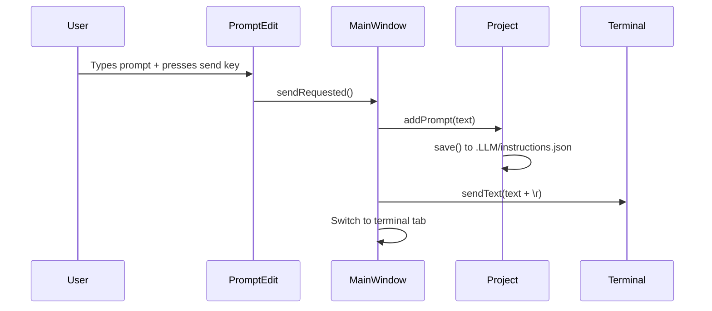

## Signal Flow — Save and Send

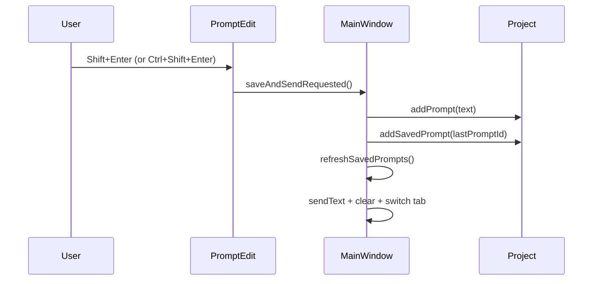

## SSH Connection Flow (Async)

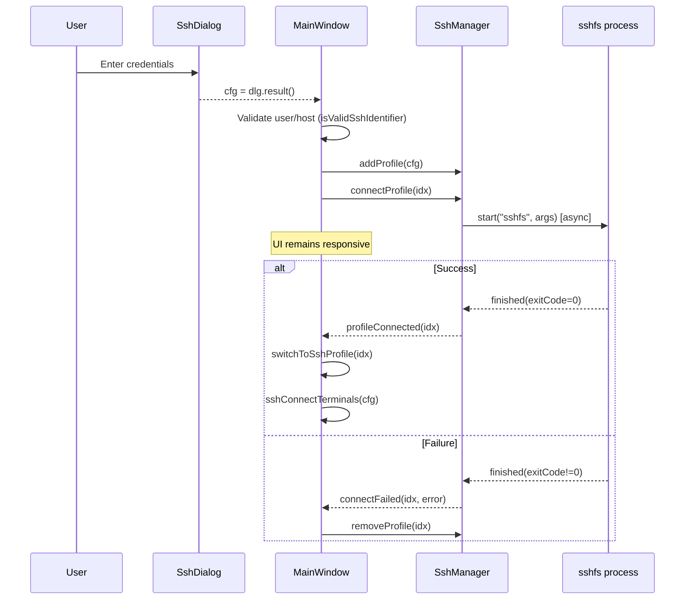

## SSH Health Check (Async Sequential)


## Async Git Commit Flow

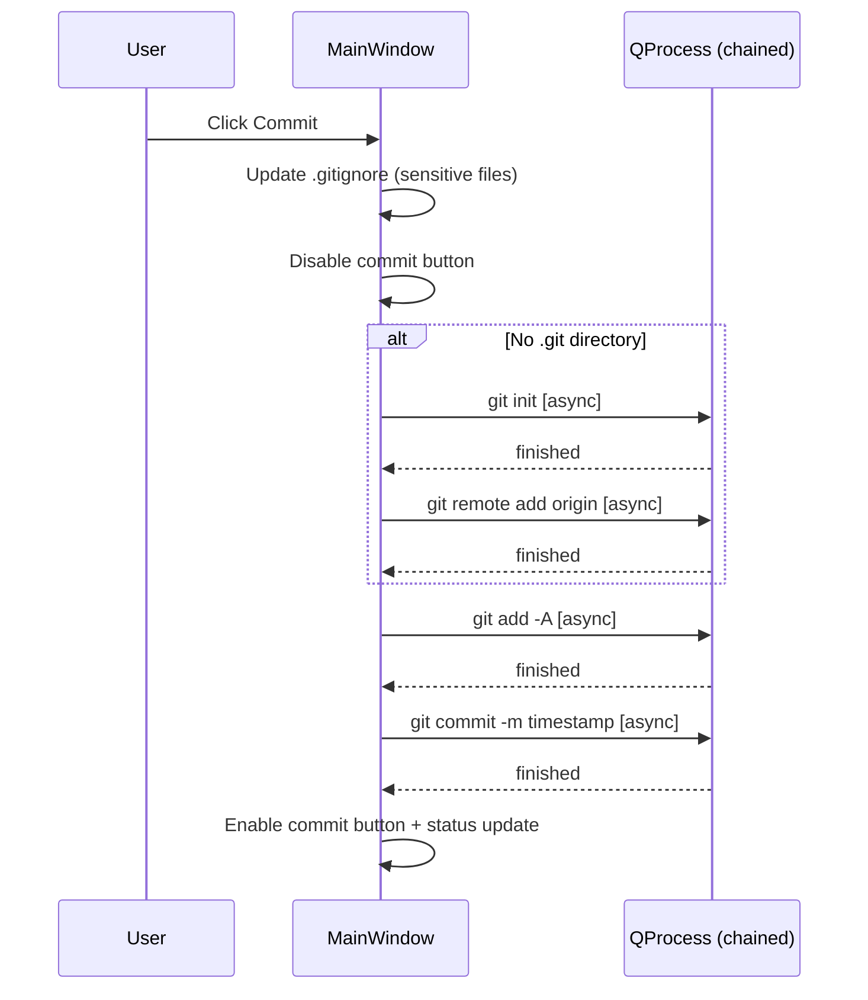

## Git Status Pipeline (Async)

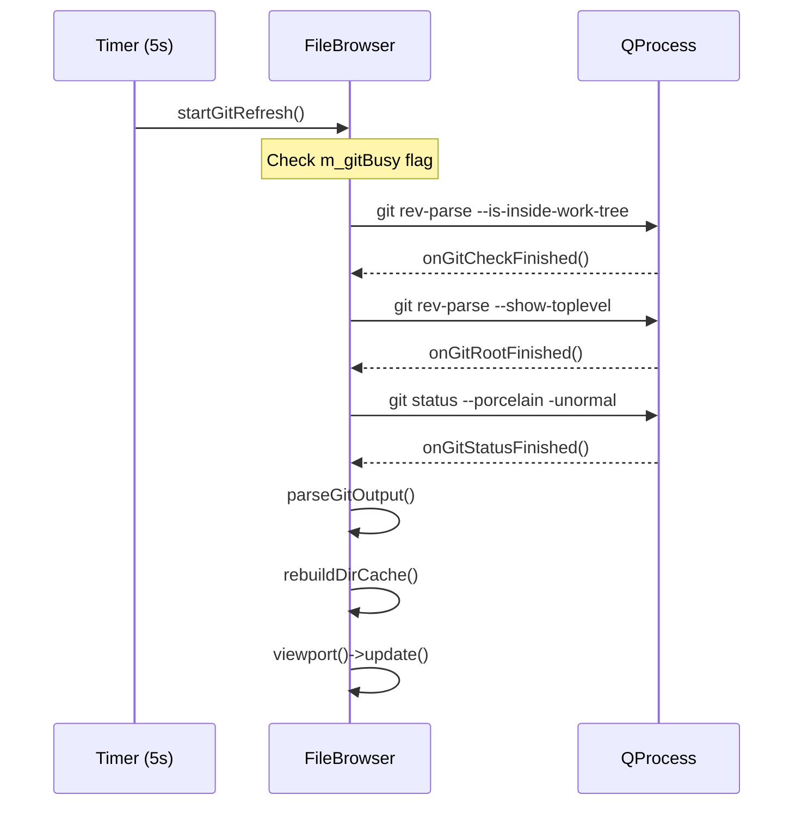

## File Transfer via sshfs Mount

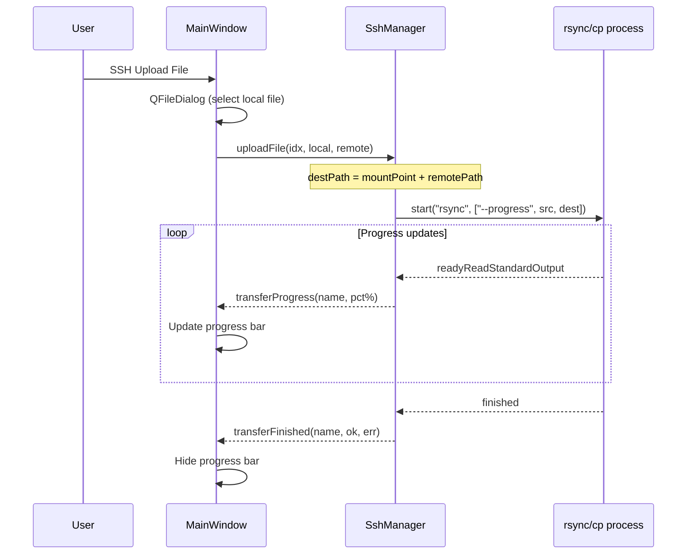

## File Open Flow

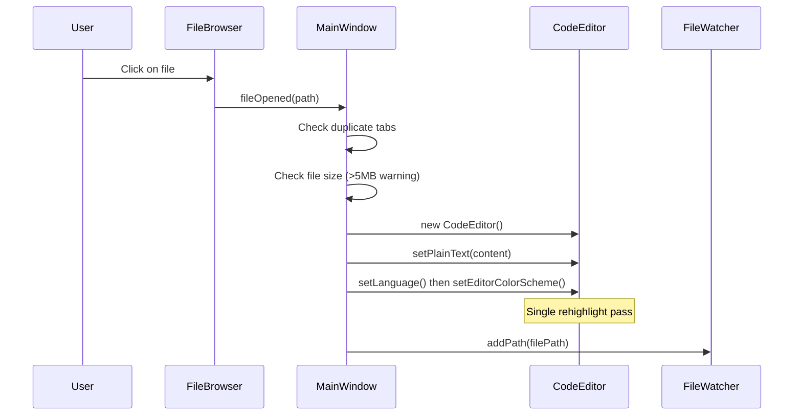

## Settings Data Flow

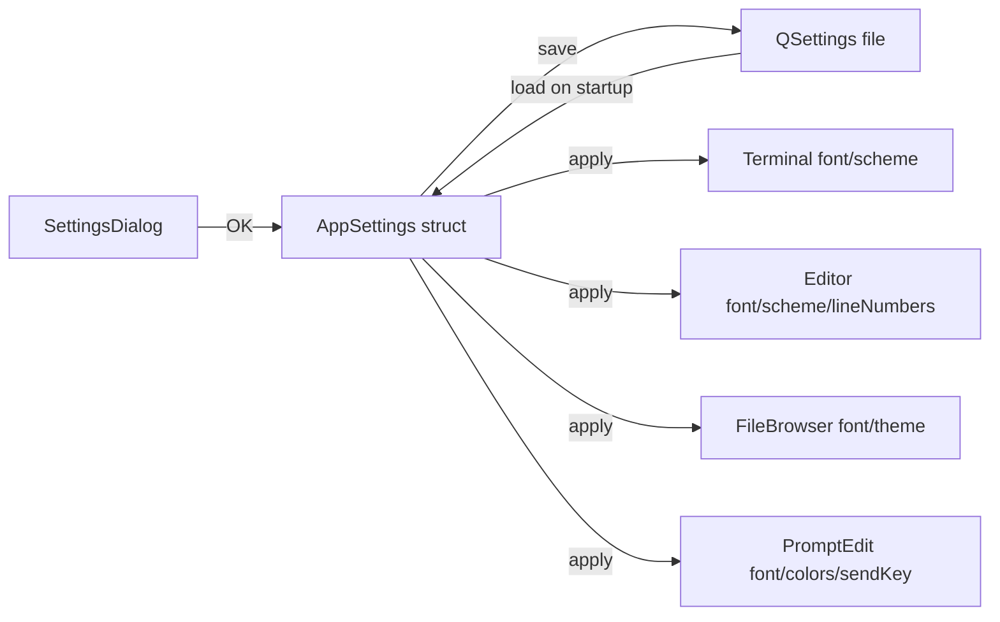

## Project Structure on Disk

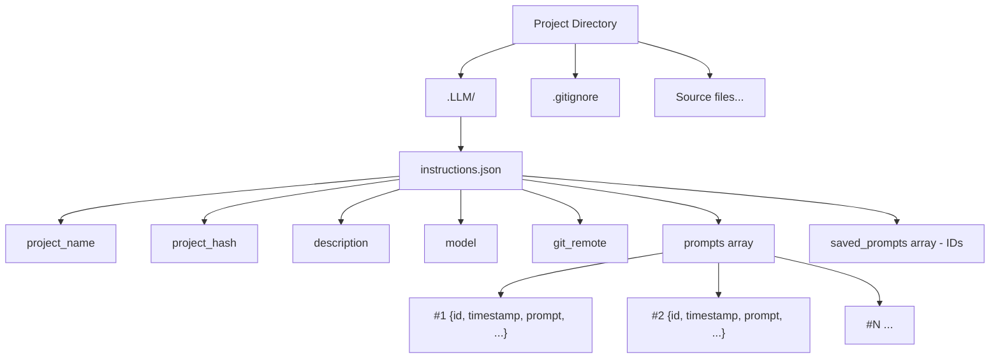

## Security Model

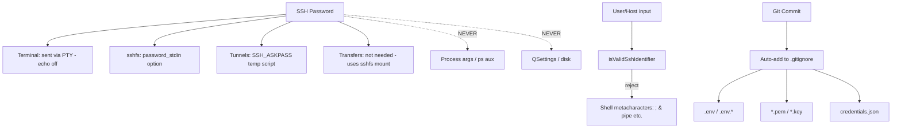
