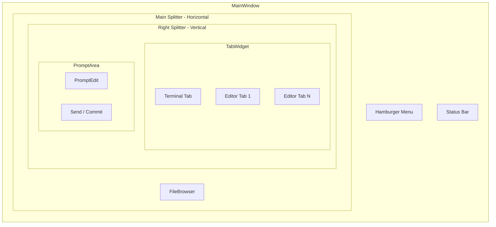
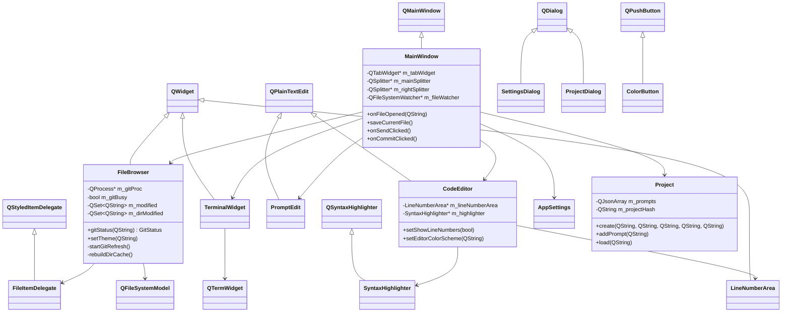
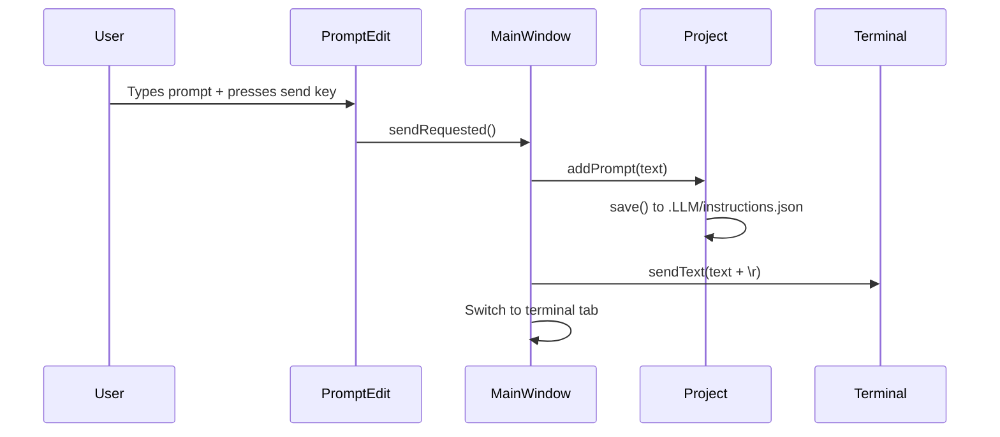
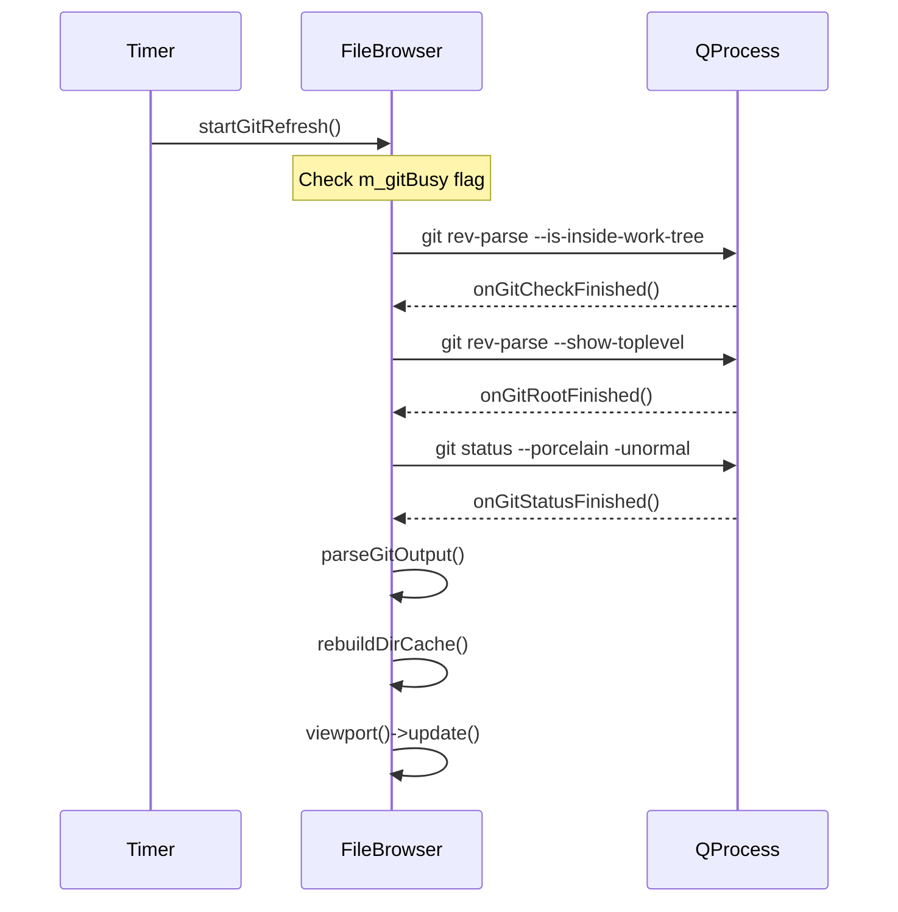
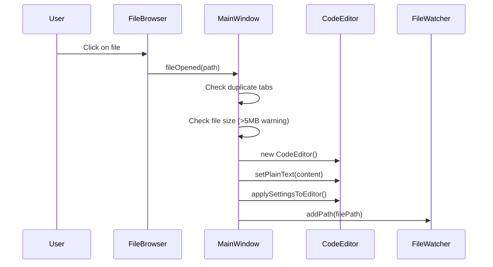
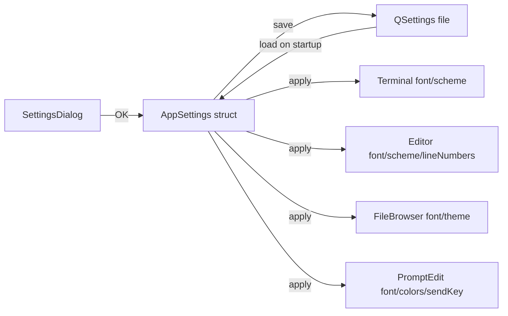
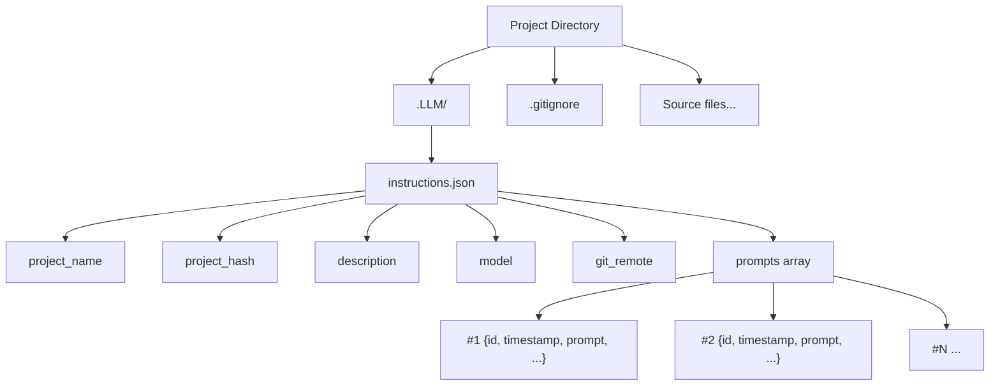

# Diagrams

## Component Layout

```mermaid
graph TB
    subgraph MainWindow
        direction TB
        HM[Hamburger Menu]
        SB[Status Bar]

        subgraph MainSplitter[Main Splitter - Horizontal]
            direction LR
            FB[FileBrowser]

            subgraph RightSplitter[Right Splitter - Vertical]
                direction TB
                subgraph TabWidget
                    T0[Terminal Tab]
                    T1[Editor Tab 1]
                    T2[Editor Tab N]
                end

                subgraph PromptArea
                    PE[PromptEdit]
                    BTN[Send / Commit]
                end
            end
        end
    end
```

## Class Hierarchy

```mermaid
classDiagram
    QMainWindow <|-- MainWindow
    QWidget <|-- FileBrowser
    QWidget <|-- TerminalWidget
    QPlainTextEdit <|-- CodeEditor
    QPlainTextEdit <|-- PromptEdit
    QStyledItemDelegate <|-- FileItemDelegate
    QSyntaxHighlighter <|-- SyntaxHighlighter
    QWidget <|-- LineNumberArea
    QDialog <|-- SettingsDialog
    QDialog <|-- ProjectDialog
    QPushButton <|-- ColorButton

    MainWindow --> FileBrowser
    MainWindow --> TerminalWidget
    MainWindow --> CodeEditor
    MainWindow --> PromptEdit
    MainWindow --> AppSettings
    MainWindow --> Project

    FileBrowser --> FileItemDelegate
    FileBrowser --> QFileSystemModel
    CodeEditor --> SyntaxHighlighter
    CodeEditor --> LineNumberArea
    TerminalWidget --> QTermWidget

    class MainWindow {
        -QTabWidget* m_tabWidget
        -QSplitter* m_mainSplitter
        -QSplitter* m_rightSplitter
        -QFileSystemWatcher* m_fileWatcher
        +onFileOpened(QString)
        +saveCurrentFile()
        +onSendClicked()
        +onCommitClicked()
    }

    class FileBrowser {
        -QProcess* m_gitProc
        -bool m_gitBusy
        -QSet~QString~ m_modified
        -QSet~QString~ m_dirModified
        +gitStatus(QString) GitStatus
        +setTheme(QString)
        -startGitRefresh()
        -rebuildDirCache()
    }

    class CodeEditor {
        -LineNumberArea* m_lineNumberArea
        -SyntaxHighlighter* m_highlighter
        +setShowLineNumbers(bool)
        +setEditorColorScheme(QString)
    }

    class Project {
        -QJsonArray m_prompts
        -QString m_projectHash
        +create(QString, QString, QString, QString, QString)
        +addPrompt(QString)
        +load(QString)
    }
```

## Signal Flow

```mermaid
sequenceDiagram
    participant User
    participant PromptEdit
    participant MainWindow
    participant Project
    participant Terminal

    User->>PromptEdit: Types prompt + presses send key
    PromptEdit->>MainWindow: sendRequested()
    MainWindow->>Project: addPrompt(text)
    Project->>Project: save() to .LLM/instructions.json
    MainWindow->>Terminal: sendText(text + \r)
    MainWindow->>MainWindow: Switch to terminal tab
```

## Git Status Pipeline (Async)

```mermaid
sequenceDiagram
    participant Timer
    participant FileBrowser
    participant GitProc as QProcess

    Timer->>FileBrowser: startGitRefresh()
    Note over FileBrowser: Check m_gitBusy flag

    FileBrowser->>GitProc: git rev-parse --is-inside-work-tree
    GitProc-->>FileBrowser: onGitCheckFinished()

    FileBrowser->>GitProc: git rev-parse --show-toplevel
    GitProc-->>FileBrowser: onGitRootFinished()

    FileBrowser->>GitProc: git status --porcelain -unormal
    GitProc-->>FileBrowser: onGitStatusFinished()

    FileBrowser->>FileBrowser: parseGitOutput()
    FileBrowser->>FileBrowser: rebuildDirCache()
    FileBrowser->>FileBrowser: viewport()->update()
```

## File Open Flow

```mermaid
sequenceDiagram
    participant User
    participant FileBrowser
    participant MainWindow
    participant CodeEditor
    participant FileWatcher

    User->>FileBrowser: Click on file
    FileBrowser->>MainWindow: fileOpened(path)
    MainWindow->>MainWindow: Check duplicate tabs
    MainWindow->>MainWindow: Check file size (>5MB warning)
    MainWindow->>CodeEditor: new CodeEditor()
    MainWindow->>CodeEditor: setPlainText(content)
    MainWindow->>CodeEditor: applySettingsToEditor()
    MainWindow->>FileWatcher: addPath(filePath)
```

## Settings Data Flow

```mermaid
flowchart LR
    A[SettingsDialog] -->|OK| B[AppSettings struct]
    B -->|save| C[QSettings file]
    B -->|apply| D[Terminal font/scheme]
    B -->|apply| E[Editor font/scheme/lineNumbers]
    B -->|apply| F[FileBrowser font/theme]
    B -->|apply| G[PromptEdit font/colors/sendKey]
    C -->|load on startup| B
```

## Project Structure on Disk

```mermaid
graph TD
    Root[Project Directory] --> LLM[.LLM/]
    Root --> GI[.gitignore]
    Root --> SRC[Source files...]
    LLM --> IJ[instructions.json]

    IJ --> PN[project_name]
    IJ --> PH[project_hash]
    IJ --> DESC[description]
    IJ --> MODEL[model]
    IJ --> GR[git_remote]
    IJ --> PROMPTS[prompts array]
    PROMPTS --> P1["#1 {id, timestamp, prompt, ...}"]
    PROMPTS --> P2["#2 {id, timestamp, prompt, ...}"]
    PROMPTS --> PN2["#N ..."]
```
