# Diagrams

## Component Layout

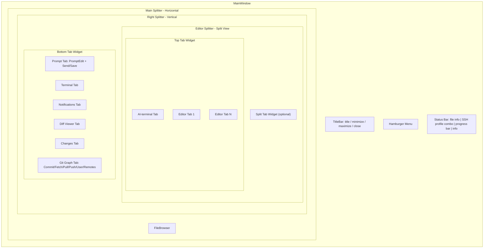
```mermaid
graph TB
    subgraph MainWindow
        direction TB
        TB["TitleBar: title / minimize / maximize / close"]
        HM[Hamburger Menu]
        SB["Status Bar: file info | SSH profile combo | progress bar | info"]

        subgraph MainSplitter[Main Splitter - Horizontal]
            direction LR
            FB[FileBrowser]

            subgraph RightSplitter[Right Splitter - Vertical]
                direction TB
                subgraph EditorSplitter[Editor Splitter - Split View]
                    subgraph TabWidget[Top Tab Widget]
                        T0[AI-terminal Tab]
                        T1[Editor Tab 1]
                        T2[Editor Tab N]
                    end
                    STW["Split Tab Widget (optional)"]
                end

                subgraph BottomTabWidget[Bottom Tab Widget]
                    PT[Prompt Tab: PromptEdit + Send/Save]
                    BT[Terminal Tab]
                    NT[Notifications Tab]
                    DV[Diff Viewer Tab]
                    CM[Changes Tab]
                    GG[Git Graph Tab: Commit/Fetch/Pull/Push/User/Remotes]
                end
            end
        end
    end
```

## Class Hierarchy

```mermaid
classDiagram
    QMainWindow <|-- MainWindow
    QWidget <|-- FileBrowser
    QWidget <|-- TerminalWidget
    QPlainTextEdit <|-- CodeEditor
    QPlainTextEdit <|-- PromptEdit
    QStyledItemDelegate <|-- FileItemDelegate
    QSyntaxHighlighter <|-- SyntaxHighlighter
    QSyntaxHighlighter <|-- DiffBlockHighlighter
    QWidget <|-- LineNumberArea
    QWidget <|-- FindReplaceBar
    QScrollBar <|-- MarkerScrollBar
    QSortFilterProxyModel <|-- FileBrowserProxy
    QWidget <|-- ChangesMonitor
    QWidget <|-- TitleBar
    QWidget <|-- DialogTitleBar
    QWidget <|-- CommandPalette
    QWidget <|-- NotificationPanel
    QDialog <|-- SettingsDialog
    QDialog <|-- ProjectDialog
    QDialog <|-- SshDialog
    QDialog <|-- SshTunnelDialog
    QWidget <|-- GitGraph
    QWidget <|-- GitGraphView
    QDialog <|-- ThemedMessageBox
    QObject <|-- SshManager
    QWidget <|-- MarkdownPreview
    QTreeView <|-- FileBrowserTreeView

    MainWindow --> TitleBar
    MainWindow --> FileBrowser
    MainWindow --> TerminalWidget : m_terminal + m_bottomTerminal
    MainWindow --> CodeEditor
    MainWindow --> PromptEdit
    MainWindow --> AppSettings
    MainWindow --> Project
    MainWindow --> SshManager
    MainWindow --> ChangesMonitor
    MainWindow --> CommandPalette
    MainWindow --> NotificationPanel
    MainWindow --> DiffViewer
    MainWindow --> GitGraph
    MainWindow --> MarkdownPreview : m_mdPreviews list
    GitGraph --> GitGraphView
    FileBrowser --> FileBrowserTreeView

    FileBrowser --> FileItemDelegate
    FileBrowser --> QFileSystemModel : local mode
    FileBrowser --> QStandardItemModel : SSH mode
    FileBrowser --> QFileSystemWatcher : instant git updates
    CodeEditor --> SyntaxHighlighter
    CodeEditor --> LineNumberArea
    CodeEditor --> FindReplaceBar
    CodeEditor --> MarkerScrollBar
    FileBrowser --> FileBrowserProxy
    TerminalWidget --> QTermWidget
    SshManager --> SshDialog : saveConnection
    SshTunnelDialog --> SshManager
    ChangesMonitor --> DiffBlockHighlighter
    ChangesMonitor --> QFileSystemWatcher
    AppSettings --> ZedThemeLoader : loadZedThemes

    class MainWindow {
        -TitleBar* m_titleBar
        -QTabWidget* m_tabWidget
        -QTabWidget* m_bottomTabWidget
        -QSplitter* m_mainSplitter
        -QSplitter* m_rightSplitter
        -QSplitter* m_editorSplitter
        -SshManager* m_sshManager
        -ChangesMonitor* m_changesMonitor
        -CommandPalette* m_commandPalette
        -NotificationPanel* m_notificationPanel
        -DiffViewer* m_diffViewer
        -QPushButton* m_stopBtn
        -QComboBox* m_sshProfileCombo
        -QProgressBar* m_transferProgress
        +onFileOpened(QString)
        +saveCurrentFile()
        +onSendClicked()
        +onStopClicked()
        +onCommitClicked()
        +maybeSaveTab(QTabWidget*, int)
        +closeTab(QTabWidget*, int)
        +applyGlobalTheme()
        +applySettings()
        +onSshConnect()
        +onSshDisconnect()
        +splitEditorHorizontal()
        +splitEditorVertical()
        +unsplitEditor()
    }

    class FileBrowser {
        -QFileSystemModel* m_fsModel
        -QStandardItemModel* m_sshModel
        -FileBrowserProxy* m_proxyModel
        -QProcess* m_gitProc
        -QFileSystemWatcher* m_fsWatcher
        -QTimer* m_gitDebounce
        -QString m_sshMountPoint
        -QSet~QString~ m_ignored
        +gitStatus(QString) GitStatus
        +setTheme(QString, QColor, QColor)
        +setGitignoreVisibility(QString)
        +setDotGitVisibility(QString)
        +setSshMount(QString, QString)
        +clearSshMount()
        +toRemotePath(QString) QString
    }

    class ChangesMonitor {
        -QFileSystemWatcher* m_watcher
        -QTimer* m_scanTimer
        -QListWidget* m_fileList
        -QPlainTextEdit* m_diffPreview
        -QVector~FileChange~ m_changes
        -QMap~QString,QDateTime~ m_knownFiles
        +setProjectDir(QString)
        +changeCount() int
        +setViewerFont(QFont)
        +setViewerColors(QColor, QColor)
    }

    class SshManager {
        -QList~ProfileState~ m_profiles
        -QMap~int,SshTunnel~ m_tunnels
        -QTimer* m_healthTimer
        -QProcess* m_transferProc
        +addProfile(SshConfig) int
        +connectProfile(int)
        +disconnectProfile(int)
        +uploadFile(int, QString, QString)
        +downloadFile(int, QString, QString)
        +addTunnel(int, SshTunnel) int
        +isValidSshIdentifier(QString)$ bool
    }

    class CodeEditor {
        -LineNumberArea* m_lineNumberArea
        -SyntaxHighlighter* m_highlighter
        -FindReplaceBar* m_findBar
        -MarkerScrollBar* m_markerScrollBar
        -bool m_highlightLine
        +setShowLineNumbers(bool)
        +setEditorColorScheme(QString, QColor, QColor)
        +showFindBar()
        +hideFindBar()
        +setHighlightCurrentLine(bool)
    }

    class AppSettings {
        +QString globalTheme
        +QVector~ZedTheme~ zedThemes
        +QColor bgColor
        +QColor textColor
        +loadZedThemes()
        +applyThemeDefaults()
        +load()
        +save()
    }

    class GitGraph {
        -GitGraphView* m_graphView
        -QComboBox* m_branchCombo
        -QPushButton* m_fetchBtn
        -QPushButton* m_pullBtn
        -QPushButton* m_pushBtn
        -QPushButton* m_commitBtn
        -QPushButton* m_userBtn
        -QLabel* m_trackingLabel
        -QMap~QString,QString~ m_remotes
        +refresh(QString)
        +commitRequested() signal
        +loadUserInfo()
        +showUserDialog()
    }

    class MarkdownPreview {
        -QWebEngineView* m_webView
        -QTimer* m_debounce
        -bool m_pageLoaded
        -void* m_cmarkLib
        -QString m_mermaidJsPath
        -QString m_hljsPath
        -QString m_katexDir
        +updateContent(QString)
        +setDarkMode(bool)
        +setFont(QFont)
        +zoomIn()
        +zoomOut()
        +exportToPdf(QString, int, int, QString, bool, bool)
        -markdownToHtml(QString) QString
        -cmarkConvert(QString) QString
        -regexConvert(QString) QString
        -loadBasePage()
        -render()
        -injectPrintCss(function)
        -removePrintCss()
        -postProcessPdf(QByteArray, QString, QPageLayout, QString, bool)
    }

    class ZedThemeLoader {
        +loadAll()$ QVector~ZedTheme~
        -parseFile(QString)$ QVector~ZedTheme~
    }
```

## Signal Flow — Prompt Send

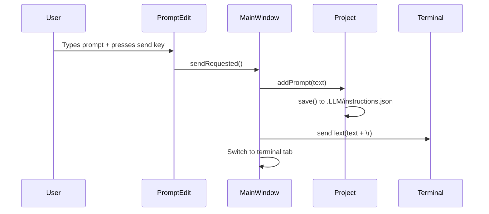
```mermaid
sequenceDiagram
    participant User
    participant PromptEdit
    participant MainWindow
    participant Project
    participant Terminal

    User->>PromptEdit: Types prompt + presses send key
    PromptEdit->>MainWindow: sendRequested()
    MainWindow->>Project: addPrompt(text)
    Project->>Project: save() to .LLM/instructions.json
    MainWindow->>Terminal: sendText(text + \r)
    MainWindow->>MainWindow: Switch to terminal tab
```

## Signal Flow — Save and Send

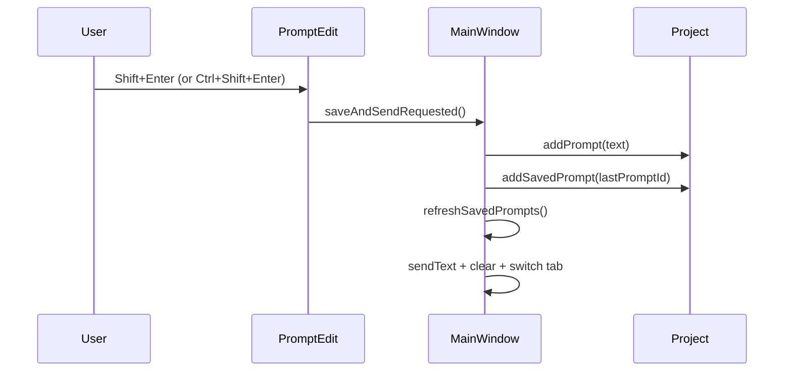
```mermaid
sequenceDiagram
    participant User
    participant PromptEdit
    participant MainWindow
    participant Project

    User->>PromptEdit: Shift+Enter (or Ctrl+Shift+Enter)
    PromptEdit->>MainWindow: saveAndSendRequested()
    MainWindow->>Project: addPrompt(text)
    MainWindow->>Project: addSavedPrompt(lastPromptId)
    MainWindow->>MainWindow: refreshSavedPrompts()
    MainWindow->>MainWindow: sendText + clear + switch tab
```

## Theme Application Flow

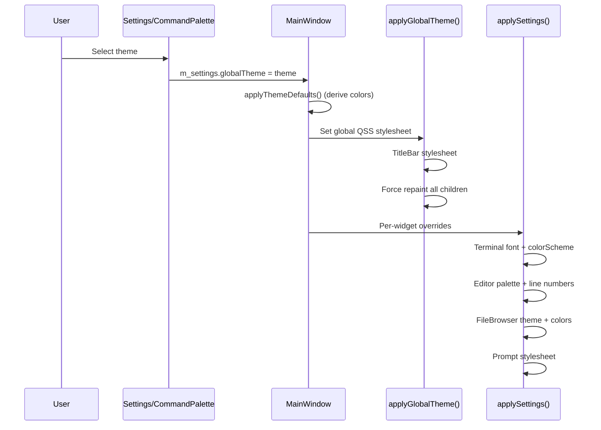
```mermaid
sequenceDiagram
    participant User
    participant Settings as Settings/CommandPalette
    participant MW as MainWindow
    participant Global as applyGlobalTheme()
    participant Widgets as applySettings()

    User->>Settings: Select theme
    Settings->>MW: m_settings.globalTheme = theme
    MW->>MW: applyThemeDefaults() (derive colors)
    MW->>Global: Set global QSS stylesheet
    Global->>Global: TitleBar stylesheet
    Global->>Global: Force repaint all children
    MW->>Widgets: Per-widget overrides
    Widgets->>Widgets: Terminal font + colorScheme
    Widgets->>Widgets: Editor palette + line numbers
    Widgets->>Widgets: FileBrowser theme + colors
    Widgets->>Widgets: Prompt stylesheet
```

## SSH Connection Flow (Async)

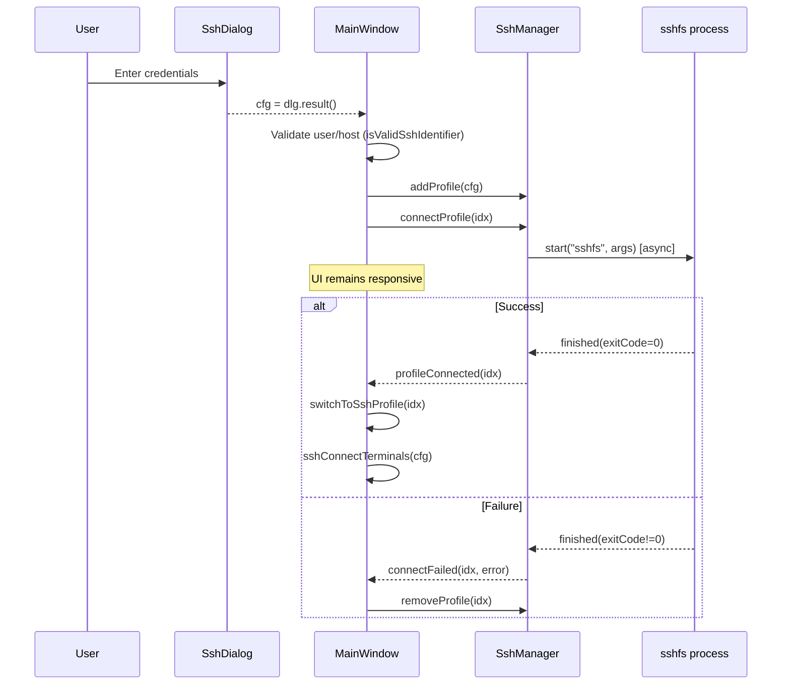
```mermaid
sequenceDiagram
    participant User
    participant SshDialog
    participant MainWindow
    participant SshManager
    participant sshfs as sshfs process

    User->>SshDialog: Enter credentials
    SshDialog-->>MainWindow: cfg = dlg.result()
    MainWindow->>MainWindow: Validate user/host (isValidSshIdentifier)
    MainWindow->>SshManager: addProfile(cfg)
    MainWindow->>SshManager: connectProfile(idx)
    SshManager->>sshfs: start("sshfs", args) [async]
    Note over MainWindow: UI remains responsive

    alt Success
        sshfs-->>SshManager: finished(exitCode=0)
        SshManager-->>MainWindow: profileConnected(idx)
        MainWindow->>MainWindow: switchToSshProfile(idx)
        MainWindow->>MainWindow: sshConnectTerminals(cfg)
    else Failure
        sshfs-->>SshManager: finished(exitCode!=0)
        SshManager-->>MainWindow: connectFailed(idx, error)
        MainWindow->>SshManager: removeProfile(idx)
    end
```

## SSH Health Check (Async Sequential)

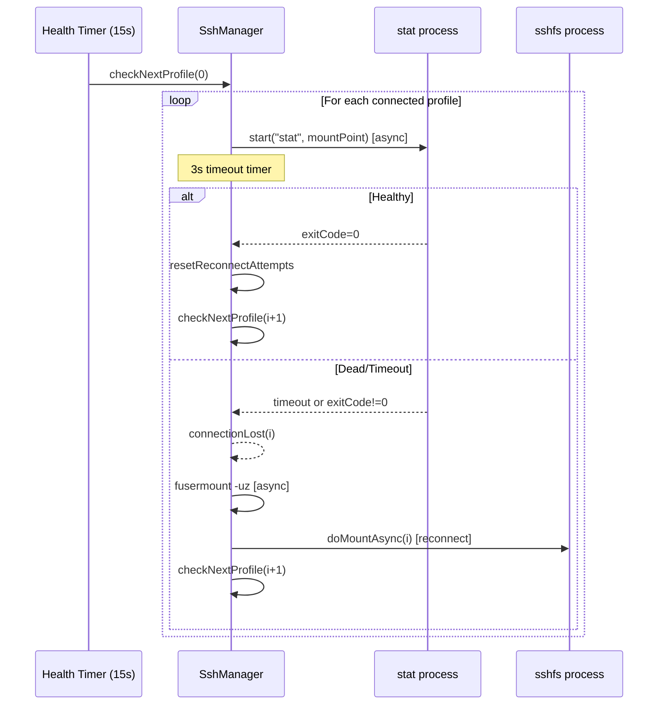
```mermaid
sequenceDiagram
    participant Timer as Health Timer (15s)
    participant SshManager
    participant stat as stat process
    participant sshfs as sshfs process

    Timer->>SshManager: checkNextProfile(0)

    loop For each connected profile
        SshManager->>stat: start("stat", mountPoint) [async]
        Note over SshManager: 3s timeout timer

        alt Healthy
            stat-->>SshManager: exitCode=0
            SshManager->>SshManager: resetReconnectAttempts
            SshManager->>SshManager: checkNextProfile(i+1)
        else Dead/Timeout
            stat-->>SshManager: timeout or exitCode!=0
            SshManager-->>SshManager: connectionLost(i)
            SshManager->>SshManager: fusermount -uz [async]
            SshManager->>sshfs: doMountAsync(i) [reconnect]
            SshManager->>SshManager: checkNextProfile(i+1)
        end
    end
```

## Async Git Commit Flow

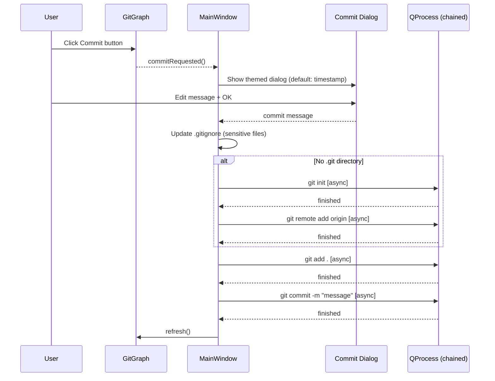
```mermaid
sequenceDiagram
    participant User
    participant GitGraph
    participant MainWindow
    participant Dialog as Commit Dialog
    participant GitProc as QProcess (chained)

    User->>GitGraph: Click Commit button
    GitGraph-->>MainWindow: commitRequested()
    MainWindow->>Dialog: Show themed dialog (default: timestamp)
    User->>Dialog: Edit message + OK
    Dialog-->>MainWindow: commit message
    MainWindow->>MainWindow: Update .gitignore (sensitive files)

    alt No .git directory
        MainWindow->>GitProc: git init [async]
        GitProc-->>MainWindow: finished
        MainWindow->>GitProc: git remote add origin [async]
        GitProc-->>MainWindow: finished
    end

    MainWindow->>GitProc: git add . [async]
    GitProc-->>MainWindow: finished
    MainWindow->>GitProc: git commit -m "message" [async]
    GitProc-->>MainWindow: finished
    MainWindow->>GitGraph: refresh()
```

## Git Status Pipeline (Async)

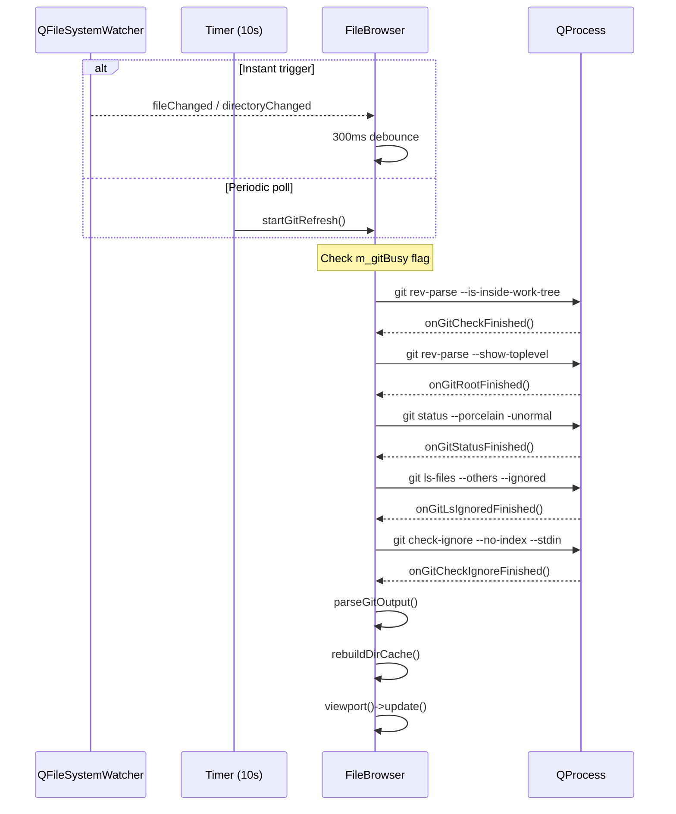
```mermaid
sequenceDiagram
    participant FSW as QFileSystemWatcher
    participant Timer as Timer (10s)
    participant FileBrowser
    participant GitProc as QProcess

    alt Instant trigger
        FSW-->>FileBrowser: fileChanged / directoryChanged
        FileBrowser->>FileBrowser: 300ms debounce
    else Periodic poll
        Timer->>FileBrowser: startGitRefresh()
    end

    Note over FileBrowser: Check m_gitBusy flag

    FileBrowser->>GitProc: git rev-parse --is-inside-work-tree
    GitProc-->>FileBrowser: onGitCheckFinished()

    FileBrowser->>GitProc: git rev-parse --show-toplevel
    GitProc-->>FileBrowser: onGitRootFinished()

    FileBrowser->>GitProc: git status --porcelain -unormal
    GitProc-->>FileBrowser: onGitStatusFinished()

    FileBrowser->>GitProc: git ls-files --others --ignored
    GitProc-->>FileBrowser: onGitLsIgnoredFinished()

    FileBrowser->>GitProc: git check-ignore --no-index --stdin
    GitProc-->>FileBrowser: onGitCheckIgnoreFinished()

    FileBrowser->>FileBrowser: parseGitOutput()
    FileBrowser->>FileBrowser: rebuildDirCache()
    FileBrowser->>FileBrowser: viewport()->update()
```

## Changes Monitor Flow

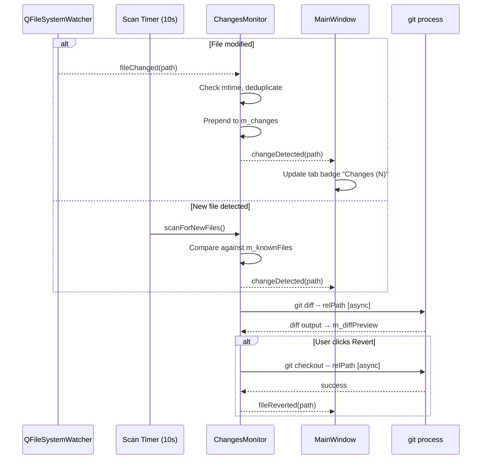
```mermaid
sequenceDiagram
    participant FS as QFileSystemWatcher
    participant Timer as Scan Timer (10s)
    participant CM as ChangesMonitor
    participant MainWindow
    participant Git as git process

    alt File modified
        FS-->>CM: fileChanged(path)
        CM->>CM: Check mtime, deduplicate
        CM->>CM: Prepend to m_changes
        CM-->>MainWindow: changeDetected(path)
        MainWindow->>MainWindow: Update tab badge "Changes (N)"
    else New file detected
        Timer->>CM: scanForNewFiles()
        CM->>CM: Compare against m_knownFiles
        CM-->>MainWindow: changeDetected(path)
    end

    CM->>Git: git diff -- relPath [async]
    Git-->>CM: diff output → m_diffPreview

    alt User clicks Revert
        CM->>Git: git checkout -- relPath [async]
        Git-->>CM: success
        CM-->>MainWindow: fileReverted(path)
    end
```

## Git Graph Flow

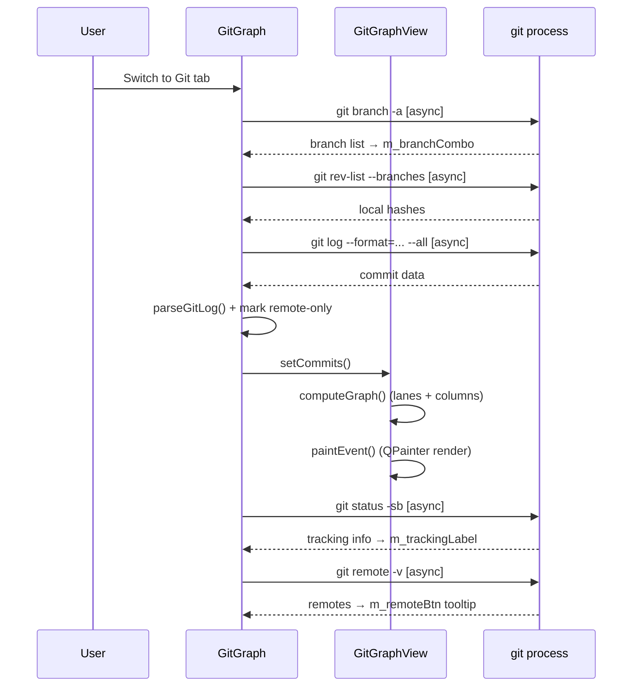
```mermaid
sequenceDiagram
    participant User
    participant GitGraph
    participant GitGraphView
    participant Git as git process

    User->>GitGraph: Switch to Git tab
    GitGraph->>Git: git branch -a [async]
    Git-->>GitGraph: branch list → m_branchCombo
    GitGraph->>Git: git rev-list --branches [async]
    Git-->>GitGraph: local hashes
    GitGraph->>Git: git log --format=... --all [async]
    Git-->>GitGraph: commit data
    GitGraph->>GitGraph: parseGitLog() + mark remote-only
    GitGraph->>GitGraphView: setCommits()
    GitGraphView->>GitGraphView: computeGraph() (lanes + columns)
    GitGraphView->>GitGraphView: paintEvent() (QPainter render)

    GitGraph->>Git: git status -sb [async]
    Git-->>GitGraph: tracking info → m_trackingLabel

    GitGraph->>Git: git remote -v [async]
    Git-->>GitGraph: remotes → m_remoteBtn tooltip
```

## Git Remote Operations

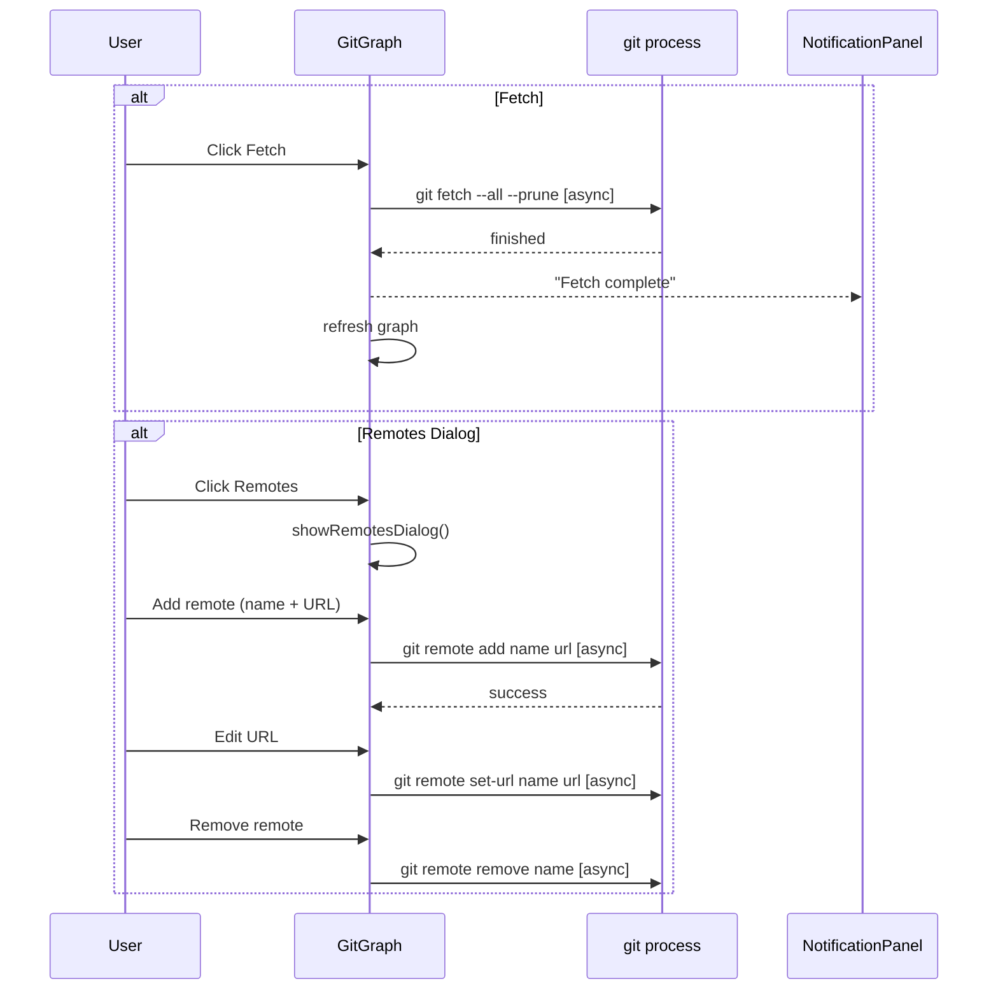
```mermaid
sequenceDiagram
    participant User
    participant GitGraph
    participant Git as git process
    participant Notify as NotificationPanel

    alt Fetch
        User->>GitGraph: Click Fetch
        GitGraph->>Git: git fetch --all --prune [async]
        Git-->>GitGraph: finished
        GitGraph-->>Notify: "Fetch complete"
        GitGraph->>GitGraph: refresh graph
    end

    alt Remotes Dialog
        User->>GitGraph: Click Remotes
        GitGraph->>GitGraph: showRemotesDialog()
        User->>GitGraph: Add remote (name + URL)
        GitGraph->>Git: git remote add name url [async]
        Git-->>GitGraph: success
        User->>GitGraph: Edit URL
        GitGraph->>Git: git remote set-url name url [async]
        User->>GitGraph: Remove remote
        GitGraph->>Git: git remote remove name [async]
    end
```

## File Transfer via sshfs Mount

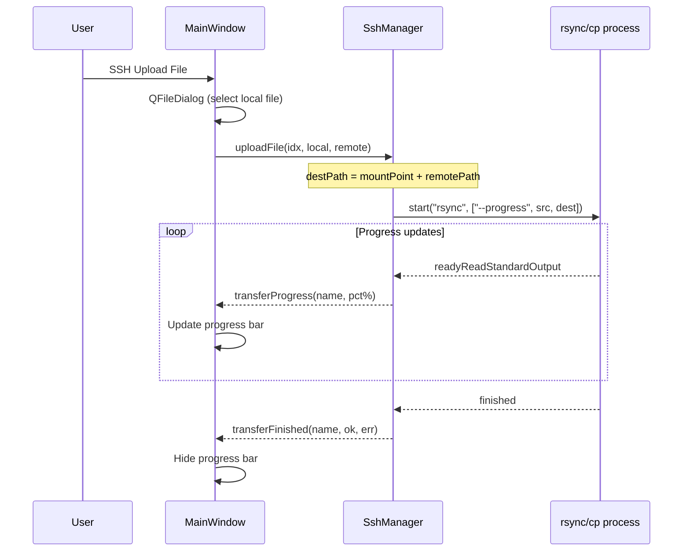
```mermaid
sequenceDiagram
    participant User
    participant MainWindow
    participant SshManager
    participant rsync as rsync/cp process

    User->>MainWindow: SSH Upload File
    MainWindow->>MainWindow: QFileDialog (select local file)
    MainWindow->>SshManager: uploadFile(idx, local, remote)
    Note over SshManager: destPath = mountPoint + remotePath
    SshManager->>rsync: start("rsync", ["--progress", src, dest])

    loop Progress updates
        rsync-->>SshManager: readyReadStandardOutput
        SshManager-->>MainWindow: transferProgress(name, pct%)
        MainWindow->>MainWindow: Update progress bar
    end

    rsync-->>SshManager: finished
    SshManager-->>MainWindow: transferFinished(name, ok, err)
    MainWindow->>MainWindow: Hide progress bar
```

## File Open Flow

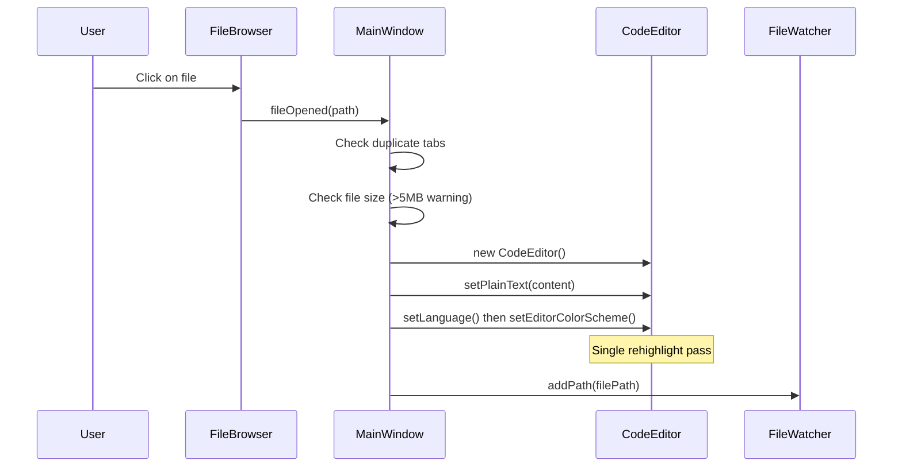
```mermaid
sequenceDiagram
    participant User
    participant FileBrowser
    participant MainWindow
    participant CodeEditor
    participant FileWatcher

    User->>FileBrowser: Click on file
    FileBrowser->>MainWindow: fileOpened(path)
    MainWindow->>MainWindow: Check duplicate tabs
    MainWindow->>MainWindow: Check file size (>5MB warning)
    MainWindow->>CodeEditor: new CodeEditor()
    MainWindow->>CodeEditor: setPlainText(content)
    MainWindow->>CodeEditor: setLanguage() then setEditorColorScheme()
    Note over CodeEditor: Single rehighlight pass
    MainWindow->>FileWatcher: addPath(filePath)
```

## Settings Data Flow

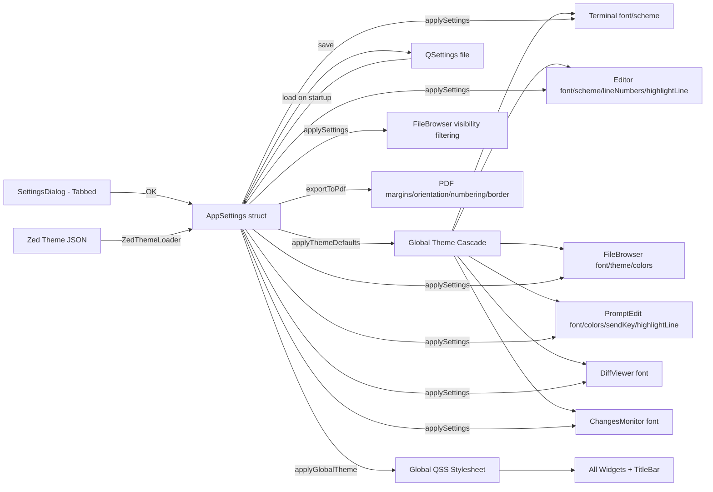
```mermaid
flowchart LR
    A[SettingsDialog - Tabbed] -->|OK| B[AppSettings struct]
    B -->|applyThemeDefaults| TH[Global Theme Cascade]
    ZED[Zed Theme JSON] -->|ZedThemeLoader| B
    TH --> D & E & F & G & DV & CM2
    B -->|save| C[QSettings file]
    B -->|applyGlobalTheme| SS[Global QSS Stylesheet]
    SS --> ALL[All Widgets + TitleBar]
    B -->|applySettings| D[Terminal font/scheme]
    B -->|applySettings| E[Editor font/scheme/lineNumbers/highlightLine]
    B -->|applySettings| VIS[FileBrowser visibility filtering]
    B -->|applySettings| F[FileBrowser font/theme/colors]
    B -->|applySettings| G[PromptEdit font/colors/sendKey/highlightLine]
    B -->|applySettings| DV[DiffViewer font]
    B -->|applySettings| CM2[ChangesMonitor font]
    B -->|exportToPdf| PDF[PDF margins/orientation/numbering/border]
    C -->|load on startup| B
```

## Project Structure on Disk

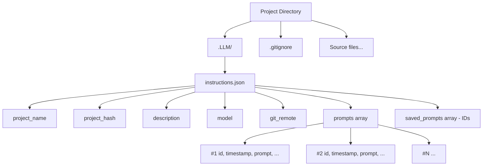
```mermaid
graph TD
    Root[Project Directory] --> LLM[.LLM/]
    Root --> GI[.gitignore]
    Root --> SRC[Source files...]
    LLM --> IJ[instructions.json]

    IJ --> PN[project_name]
    IJ --> PH[project_hash]
    IJ --> DESC[description]
    IJ --> MODEL[model]
    IJ --> GR[git_remote]
    IJ --> PROMPTS[prompts array]
    IJ --> SP[saved_prompts array - IDs]
    PROMPTS --> P1["#1 id, timestamp, prompt, ..."]
    PROMPTS --> P2["#2 id, timestamp, prompt, ..."]
    PROMPTS --> PN2["#N ..."]
```

## Security Model

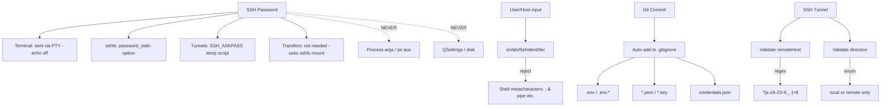
```mermaid
flowchart TD
    PWD[SSH Password] --> T1[Terminal: sent via PTY - echo off]
    PWD --> T2[sshfs: password_stdin option]
    PWD --> T3[Tunnels: SSH_ASKPASS temp script]
    PWD --> T4[Transfers: not needed - uses sshfs mount]
    PWD -.->|NEVER| PS[Process args / ps aux]
    PWD -.->|NEVER| DISK[QSettings / disk]

    INPUT[User/Host input] --> VAL[isValidSshIdentifier]
    VAL -->|reject| META["Shell metacharacters: ; & pipe etc."]

    COMMIT[Git Commit] --> GITIGNORE[Auto-add to .gitignore]
    GITIGNORE --> ENV[.env / .env.*]
    GITIGNORE --> PEM[*.pem / *.key]
    GITIGNORE --> CRED[credentials.json]

    TUNNEL[SSH Tunnel] --> TVAL[Validate remoteHost]
    TVAL -->|regex| SAFE["^[a-zA-Z0-9._-]+$"]
    TUNNEL --> DVAL[Validate direction]
    DVAL -->|enum| DIR["local or remote only"]
```

## Markdown Preview Flow

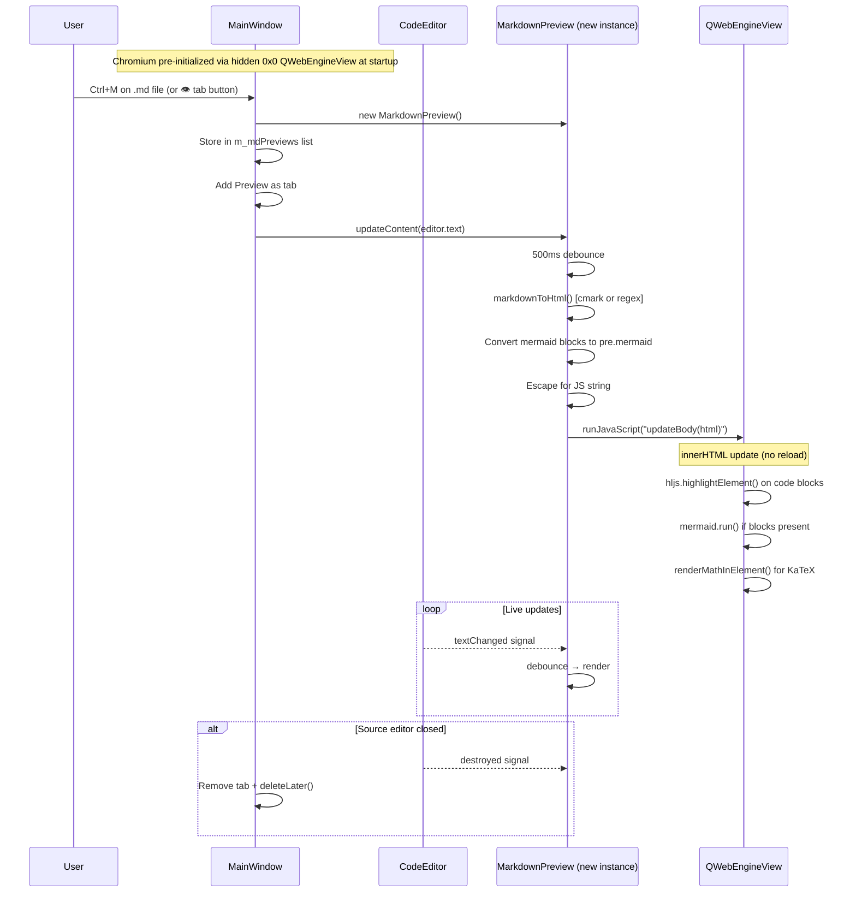
```mermaid
sequenceDiagram
    participant User
    participant MainWindow
    participant Editor as CodeEditor
    participant Preview as MarkdownPreview (new instance)
    participant WebView as QWebEngineView

    Note over MainWindow: Chromium pre-initialized via hidden 0x0 QWebEngineView at startup

    User->>MainWindow: Ctrl+M on .md file (or 👁 tab button)
    MainWindow->>Preview: new MarkdownPreview()
    MainWindow->>MainWindow: Store in m_mdPreviews list
    MainWindow->>MainWindow: Add Preview as tab
    MainWindow->>Preview: updateContent(editor.text)
    Preview->>Preview: 500ms debounce

    Preview->>Preview: markdownToHtml() [cmark or regex]
    Preview->>Preview: Convert mermaid blocks to pre.mermaid
    Preview->>Preview: Escape for JS string
    Preview->>WebView: runJavaScript("updateBody(html)")

    Note over WebView: innerHTML update (no reload)
    WebView->>WebView: hljs.highlightElement() on code blocks
    WebView->>WebView: mermaid.run() if blocks present
    WebView->>WebView: renderMathInElement() for KaTeX

    loop Live updates
        Editor-->>Preview: textChanged signal
        Preview->>Preview: debounce → render
    end

    alt Source editor closed
        Editor-->>Preview: destroyed signal
        MainWindow->>MainWindow: Remove tab + deleteLater()
    end
```

## Markdown Rendering Architecture

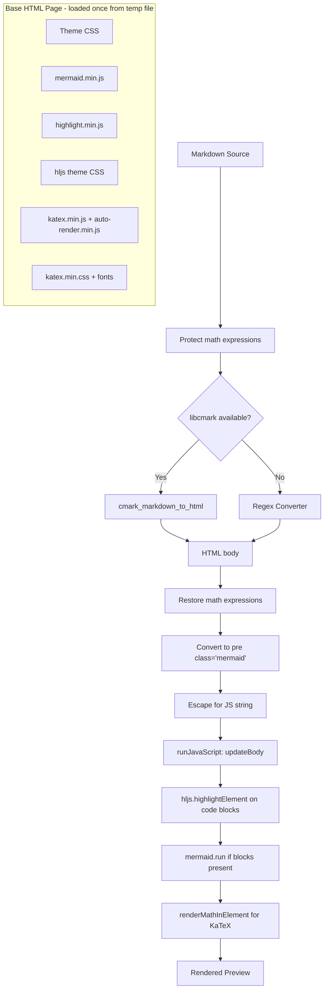
```mermaid
flowchart TD
    MD[Markdown Source] --> PROT[Protect math expressions]
    PROT --> CMARK{libcmark available?}
    CMARK -->|Yes| CM[cmark_markdown_to_html]
    CMARK -->|No| RX[Regex Converter]
    CM --> HTML[HTML body]
    RX --> HTML
    HTML --> RESTORE[Restore math expressions]

    RESTORE --> MERM[Convert to pre class='mermaid']
    MERM --> ESC[Escape for JS string]
    ESC --> JS[runJavaScript: updateBody]

    subgraph Base_Page[Base HTML Page - loaded once from temp file]
        CSS[Theme CSS] & MJS[mermaid.min.js] & HLJS[highlight.min.js] & HCSS[hljs theme CSS] & KJS[katex.min.js + auto-render.min.js] & KCSS[katex.min.css + fonts]
    end

    JS --> HIGHLIGHT[hljs.highlightElement on code blocks]
    HIGHLIGHT --> MRUN[mermaid.run if blocks present]
    MRUN --> KATEX[renderMathInElement for KaTeX]
    KATEX --> RENDER[Rendered Preview]
```

## PDF Export Flow

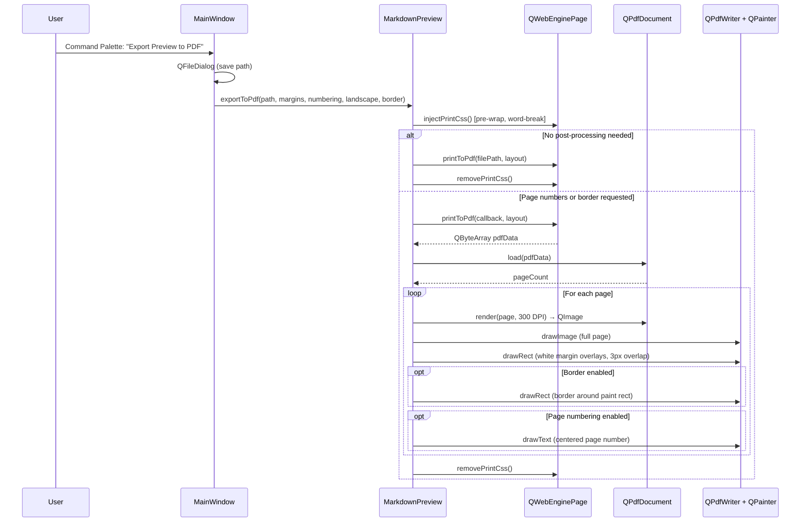
```mermaid
sequenceDiagram
    participant User
    participant MainWindow
    participant Preview as MarkdownPreview
    participant WebEngine as QWebEnginePage
    participant PdfDoc as QPdfDocument
    participant PdfWriter as QPdfWriter + QPainter

    User->>MainWindow: Command Palette: "Export Preview to PDF"
    MainWindow->>MainWindow: QFileDialog (save path)
    MainWindow->>Preview: exportToPdf(path, margins, numbering, landscape, border)

    Preview->>WebEngine: injectPrintCss() [pre-wrap, word-break]

    alt No post-processing needed
        Preview->>WebEngine: printToPdf(filePath, layout)
        Preview->>WebEngine: removePrintCss()
    else Page numbers or border requested
        Preview->>WebEngine: printToPdf(callback, layout)
        WebEngine-->>Preview: QByteArray pdfData

        Preview->>PdfDoc: load(pdfData)
        PdfDoc-->>Preview: pageCount

        loop For each page
            Preview->>PdfDoc: render(page, 300 DPI) → QImage
            Preview->>PdfWriter: drawImage (full page)
            Preview->>PdfWriter: drawRect (white margin overlays, 3px overlap)
            opt Border enabled
                Preview->>PdfWriter: drawRect (border around paint rect)
            end
            opt Page numbering enabled
                Preview->>PdfWriter: drawText (centered page number)
            end
        end

        Preview->>WebEngine: removePrintCss()
    end
```
